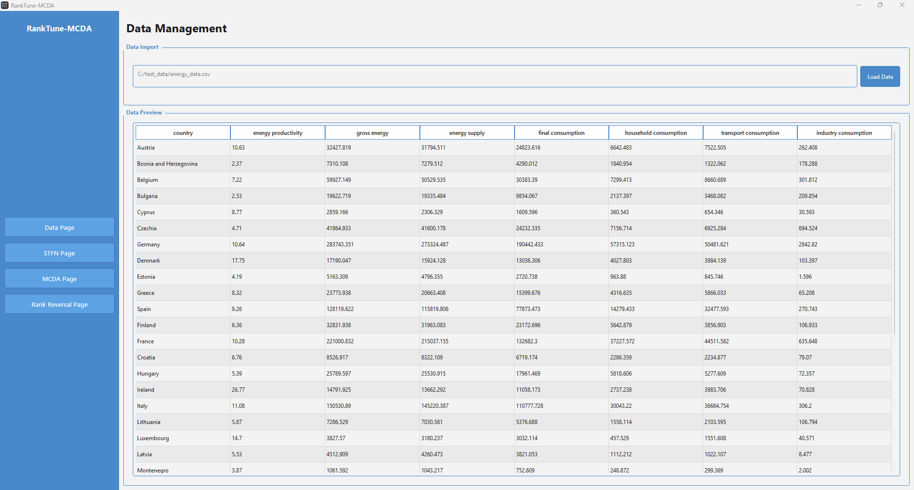
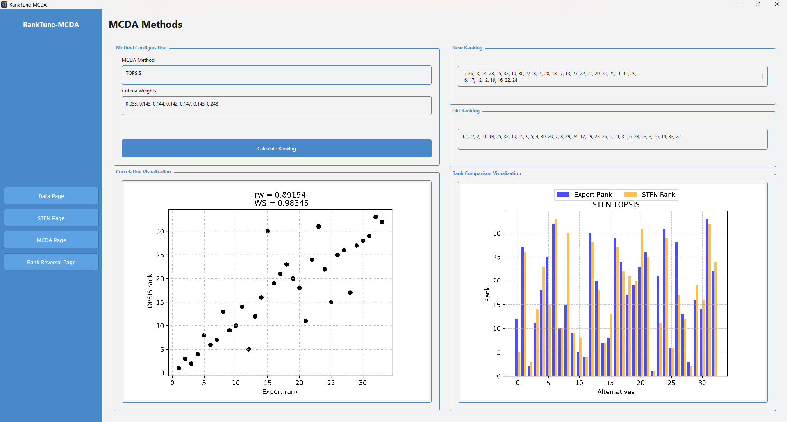
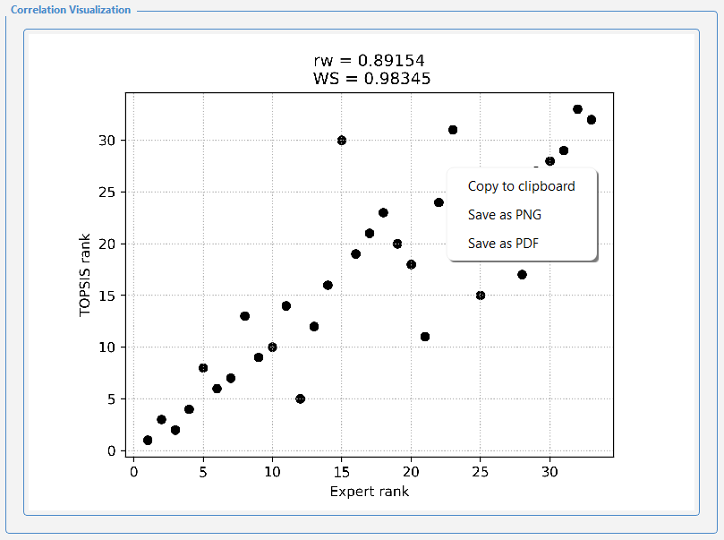
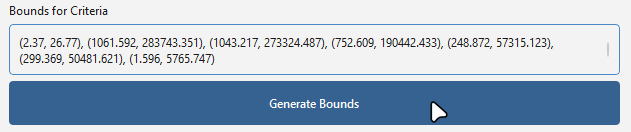

# pymcdm-reidentify-wrapper

GUI wrapper for [pymcdm-reidentify](https://github.com/kiziebar/pymcdm-reidentify) Python package.

---

## How to install

### 1. Downloading the Executable (Recommended)

The easiest way to use the application on **Windows** is to download the latest executable file from the **Releases** page and double-click it to run the application.

* **Linux/MacOS:** You can run the application though running from source or building your own executable is recommended.

### 2. Cloning the repository

If you prefer to run the application from the source code:

1. Clone the repository:
    ```bash
    git clone https://github.com/dominikmol/pymcdm-reidentify-wrapper.git
    cd pymcdm-reidentify-wrapper
    ```
2. Set up the environment:
    It is recommended to create a virtual environment before installing dependencies:
    ```bash
    # Create environment
    python -m venv mcdm-gui

    # Activate (Windows)
    mcdm-gui\Scripts\activate

    # Activate (Linux/macOS)
    source mcdm-gui/bin/activate

    # Install required packages
    pip install -r .\requirements.txt
    ```

    To confirm installed packages
    ```bash
    pip list
    ```
3. Run the application:
    ```bash
    cd src
    python main.py
    ```
This method ensures compatibility across all supported platforms.

---

## How to use

### Preparing the Data File

The application supports **CSV, TXT, XLS, and XLSX** formats. To ensure the STFN method works correctly, your dataset must follow this structure:

* **Header Row:** Contains the names of the criteria.
* **First Column:** Lists the names of the alternatives.
* **Numeric Values:** All data must be numerical, using a **dot (.)** as a decimal separator.
* **Delimiters:** For CSV or TXT files, values must be separated by a **comma**.

> **Note:** Example files are available in the `examples` folder for reference.

### Step 1: Loading Data

In the **Data** section, click the **"Load Data"** button to import your prepared file.



### Step 2: Configuring STFN

After importing the data, navigate to the **STFN page**. In this section, you will need to:
* **Define Bounds:** Set specific bounds for each criterion or use the **"Generate Bounds"** button to automate the process.
* **Input Ranking:** Provide the initial ranking for your alternatives.
* **Select MCDM/MCDA Method:** Choose the desired decision-making method from the dropdown menu.
* **Set Weights:** Assign weights to your criteria.
* **PSO Optimization:** Configure the Particle Swarm Optimization parameters (default values are pre-configured for a quick start).

### Step 3: Calculating STFN

Click the **"Calculate STFN"** button to begin the re-identification process. Once the process is finished, the application will:
1. Display the **discovered core values** for the dataset.
2. Allow you to switch between various plots representing the **redefined core fuzzy numbers**.


### Step 4: Comparison of Rankings

The final page provides a summary of the selected MCDM/MCDA method, weights, and the original ranking. By clicking the **"Calculate Ranking"** button, the application generates a new ranking based on the STFN core values. To visualize the results, the application displays two comparison plots showing the correlation between your initial ranking and the newly calculated one.




---

## Additional Features

### Saving and Copying Visualizations
All generated plots are interactive. You can export them using one of two methods:
* **Save as Image:** Right-click on any plot and select **"Save as..."** to export the visualization as a `.png`, `.svg`, or `.pdf` file.
* **Copy to Clipboard:** Right-click on the plot and select **"Copy to Clipboard"** to quickly paste the image into another application.



### Automatic Bounds Generation
If you are unsure about the specific range for your criteria, the application can suggest them automatically:
* **Generate Bounds:** Located in the STFN configuration section, this button processes your input data and automatically calculates the lower and upper bounds for each criterion.

