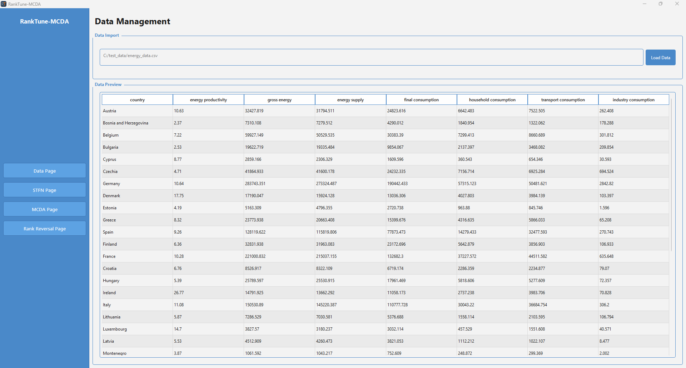
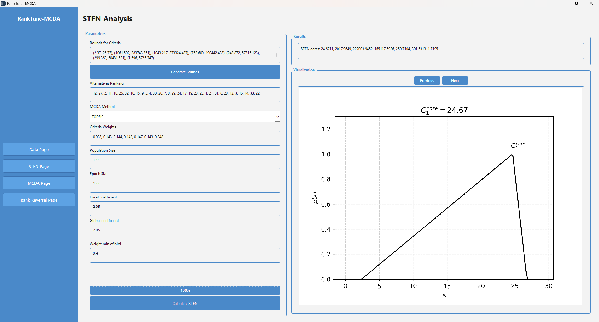
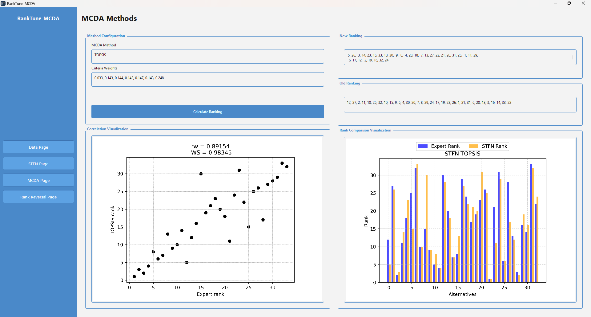
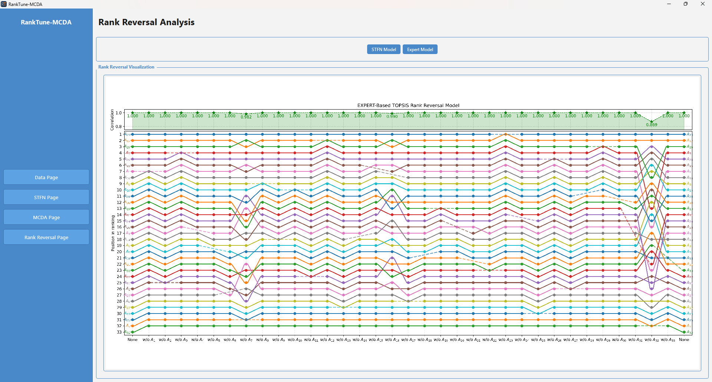
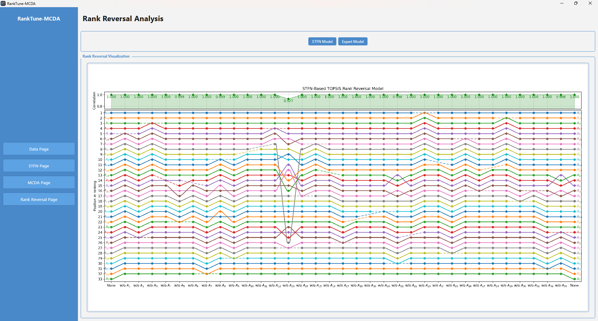
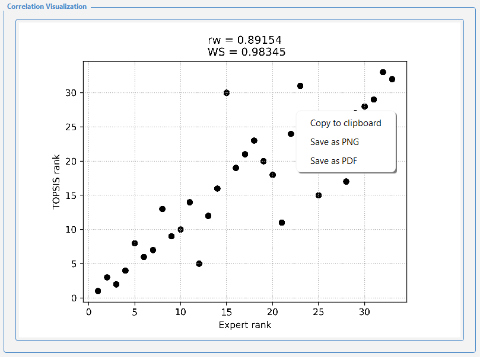
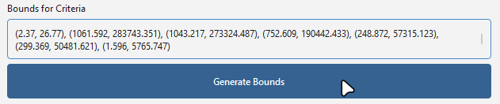

<p align="center">
  
</p>

# RankTune-MCDA

RankTune-MCDA is a GUI-based calibration framework for reidentifying MCDA/MCDM models. Built with **PySide**, it provides a standalone, no-code interface for the [pymcdm-reidentify](https://github.com/kiziebar/pymcdm-reidentify) pipeline.

---

## How to install

### 1. Downloading the Executable (Recommended)

The easiest way to use the application on **Windows** is to download the latest executable file from the **Releases** page and double-click it to run the application.

* **Linux/MacOS:** You can run the application though running from source or building your own executable is recommended.

### 2. Cloning the repository

If you prefer to run the application from the source code:

1. Clone the repository:
    ```bash
    git clone https://github.com/domolenda/RankTune-MCDA.git
    cd RankTune-MCDA
    ```
2. Set up the environment:
    It is recommended to create a virtual environment before installing dependencies:
    ```bash
    # Create environment
    python -m venv mcdm-gui

    # Activate (Windows)
    mcdm-gui\Scripts\activate

    # Activate (Linux/macOS)
    source mcdm-gui/bin/activate

    # Install required packages
    pip install -r .\requirements.txt
    ```

    To confirm installed packages
    ```bash
    pip list
    ```
3. Run the application:
    ```bash
    cd src
    python main.py
    ```
This method ensures compatibility across all supported platforms.

---

## How to use

### Preparing the Data File

The application supports **CSV, TXT, XLS, and XLSX** formats. To ensure the STFN method works correctly, your dataset must follow this structure:

* **Header Row:** Contains the names of the criteria.
* **First Column:** Lists the names of the alternatives.
* **Numeric Values:** All data must be numerical, using a **dot (.)** as a decimal separator.
* **Delimiters:** For CSV or TXT files, values must be separated by a **comma**.

> **Note:** Example files are available in the `examples` folder for reference.

### Step 1: Loading Data

In the **Data** section, click the **"Load Data"** button to import your prepared file.



### Step 2: Configuring STFN

After importing the data, navigate to the **STFN page**. In this section, you will need to:
* **Define Bounds:** Set specific bounds for each criterion or use the **"Generate Bounds"** button to automate the process.
* **Input Ranking:** Provide the initial ranking for your alternatives.
* **Select MCDM/MCDA Method:** Choose the desired decision-making method from the dropdown menu.
* **Set Weights:** Assign weights to your criteria.
* **PSO Optimization:** Configure the Particle Swarm Optimization parameters (default values are pre-configured for a quick start).

#### Example configuration

> **Note:** The values below are from testing with the `energy_data.csv` file (located in the `examples` folder).
> The bounds were generated using the **"Generate Bounds"** button, weights calculated using entropy methods, 
> and rankings computed using TOPSIS, MABAC, and VIKOR methods.

#### Bounds for example data
```
(2.37, 26.77), (1061.592, 283743.351), (1043.217, 273324.487), (752.609, 190442.433), (248.872, 57315.123), (299.369, 50481.621), (1.596, 5765.747)
```

#### Weights for example data
```
0.033, 0.143, 0.144, 0.142, 0.147, 0.143, 0.248
```

#### Rank for TOPSIS
```
12, 27, 2, 11, 18, 25, 32, 10, 15, 9, 5, 4, 30, 20, 7, 8, 29, 24, 17, 19, 23, 26, 1, 21, 31, 6, 28, 13, 3, 16, 14, 33, 22
```
#### Rank for MABAC
```
25, 20, 21, 19, 3, 26, 32, 4, 7, 18, 28, 15, 29, 13, 22, 1, 30, 14, 2, 9, 6, 11, 5, 24, 31, 12, 27, 17, 23, 8, 16, 33, 10
```
#### Rank for VIKOR
```
12, 27, 3, 14, 15, 20, 32, 7, 19, 11, 2, 6, 30, 22, 10, 5, 29, 25, 9, 21, 23, 26, 1, 13, 31, 8, 28, 18, 4, 17, 16, 33, 24
```

### Step 3: Calculating STFN

Click the **"Calculate STFN"** button to begin the re-identification process. Once the process is finished, the application will:
1. Display the **discovered core values** for the dataset.
2. Allow you to switch between various plots representing the **redefined core fuzzy numbers**.



### Step 4: Comparison of Rankings

This page provides a summary of the selected MCDM/MCDA method, weights, and the original ranking. By clicking the **"Calculate Ranking"** button, the application generates a new ranking based on the STFN core values. To visualize the results, the application displays two comparison plots showing the correlation between your initial ranking and the newly calculated one.



### Step 5: Comparison of Rankings

The final page presents a comparison of rank reversal resistance between the [Expert-based model](#rank-reversal---expert-model) and the [STFN-based model](#rank-reversal---stfn-model). This analysis demonstrates the robustness of your MCDA solution to changes in input parameters.

### Rank Reversal - EXPERT Model

### Rank Reversal - STFN Model


---

## Additional Features

### Saving and Copying Visualizations
All generated plots are interactive. You can export them using one of two methods:
* **Save as Image:** Right-click on any plot and select **"Save as..."** to export the visualization as a `.png`, `.svg`, or `.pdf` file.
* **Copy to Clipboard:** Right-click on the plot and select **"Copy to Clipboard"** to quickly paste the image into another application.



### Automatic Bounds Generation
If you are unsure about the specific range for your criteria, the application can suggest them automatically:
* **Generate Bounds:** Located in the STFN configuration section, this button processes your input data and automatically calculates the lower and upper bounds for each criterion.


